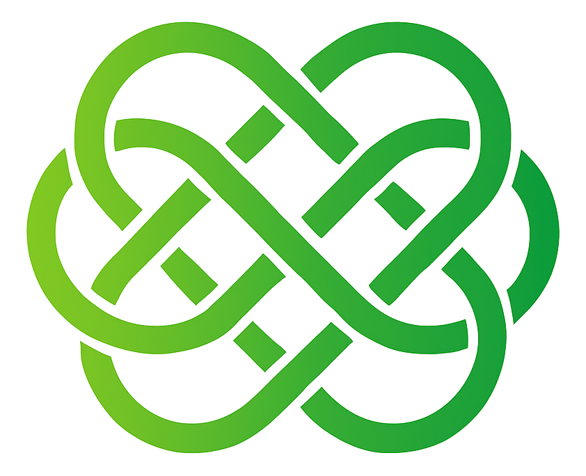

<p align="center">
  
</p>

<h1 align="center">Minuta</h1>

<p align="center">
  <strong>Local meeting transcription & AI summarization for macOS</strong><br>
  100% private — audio never leaves your device.
</p>

<p align="center">
  <a href="#features">Features</a> &bull;
  <a href="#how-it-works">How It Works</a> &bull;
  <a href="#installation">Installation</a> &bull;
  <a href="#configuration">Configuration</a> &bull;
  <a href="#usage">Usage</a> &bull;
  <a href="#pro">Pro</a> &bull;
  <a href="#tech-stack">Tech Stack</a> &bull;
  <a href="#contributing">Contributing</a>
</p>

<p align="center">
  
  
  
  
  
</p>

---

## What is Minuta?

Minuta captures audio directly from your microphone and system speakers during any meeting — Zoom, Teams, Google Meet, Slack, FaceTime — and transcribes it in real time using [MLX Whisper](https://github.com/ml-explore/mlx-examples) running locally on Apple Silicon. No audio is ever sent to the cloud. No meeting bot joins your call.

After the meeting, Minuta generates a structured AI summary with key points, action items, and decisions using your choice of LLM provider (Azure OpenAI, Ollama, or Langdock).

**Built for professionals who care about privacy.**

## Features

### Free (Open Source)

- **Local Transcription** — MLX Whisper runs on your Mac's Neural Engine. Zero latency, zero cloud.
- **Real-time Dashboard** — Watch the transcript appear live in your browser as you speak.
- **AI Summaries** — Structured meeting summaries with key points, action items, and decisions.
- **Speaker Separation** — Distinguishes your voice (microphone) from other participants (system audio).
- **Edit Everything** — Edit meeting titles, summaries, key points, and action items before sharing.
- **Meeting Archive** — Browse and search all past meetings with full transcripts.
- **Meta Fields** — Tag meetings with company, project, and domain.
- **Dark / Light Theme** — Clean design system with theme toggle.
- **No Account Required** — No sign-up, no login, no telemetry. Just install and use.

### Pro

- **Webhook / N8N Integration** — Send summaries to your automation workflows.
- **Notion Export** — Automatically create structured Notion pages from meetings.
- **Neo4J / LightRAG** — Index meeting knowledge in your graph database.
- **CSV / PDF Export** — Export transcripts and summaries in multiple formats.
- **Auto-Summary** — Automatically summarize when recording stops.
- **Priority Support** — Direct email support.

## How It Works

```
1. Start Recording    →  Click "Start Recording" in the dashboard
2. Live Transcription →  Audio captured locally, transcribed via MLX Whisper
3. AI Summary         →  GPT-4o / Ollama generates structured meeting notes
4. Export             →  Send to Notion, N8N, or download as Markdown (Pro)
```

### Architecture

```
+-----------------+    Unix Socket      +--------------------------+
|  Minuta.app     | -----------------> |  Python Backend (FastAPI) |
|  (Swift CLI)    |   PCM Audio 48kHz  |  localhost:8741           |
|                 |                    |                           |
|  AVAudioEngine  |                    |  Resample 48kHz -> 16kHz  |
|  (Microphone)   |                    |  Voice Detection (RMS)    |
|  ScreenCapture  |                    |  MLX Whisper (local)      |
|  Kit (System)   |                    |  LLM Summary (Azure/      |
+-----------------+                    |    Ollama/Langdock)       |
                                       |  SQLite Database          |
+-----------------+  HTTP + WebSocket  |  Webhook Sender           |
| Next.js Frontend| <---------------> |                           |
| localhost:3100  |                    +--------------------------+
|                 |
| Live Transcript |         +--------------------------+
| Meeting Archive | ------> |  N8N -> Notion -> Neo4J  |
| Summary Editor  | Webhook |  (Pro)                   |
+-----------------+         +--------------------------+
```

## Installation

### Requirements

- **macOS 13+** (Ventura or later)
- **Apple Silicon** (M1, M2, M3, M4)
- **Xcode Command Line Tools** (`xcode-select --install`)
- **~5 GB disk space** (for the Whisper model)

### Quick Start

```bash
# Clone the repository
git clone https://github.com/robertoslater/minuta.git
cd minuta

# Run the installer
./install.sh

# Start the backend (Terminal 1)
make dev-backend

# Start the frontend (Terminal 2)
make dev-frontend

# Open the dashboard
open http://localhost:3100
```

### macOS Permissions

On first run, macOS will ask for permissions:

1. **Microphone** — System Settings > Privacy & Security > Microphone > Enable **Minuta.app**
2. **Screen Recording** (for system audio) — System Settings > Privacy & Security > Screen Recording > Enable **Terminal.app**

> If Minuta.app doesn't appear in the Microphone list, run it once manually:
> ```bash
> open -a Minuta.app --args --no-system --socket /dev/null
> ```

## Configuration

Configuration file: `~/.minuta/config.toml`

```toml
[general]
language = "de"

[audio]
system_audio = true          # Capture system/speaker audio
microphone = true            # Capture microphone

[transcription]
model = "mlx-community/whisper-large-v3-mlx"
language = "de"              # Transcription language

[summarization]
default_provider = "azure"   # azure | ollama | langdock

[summarization.azure]
endpoint = "https://your-resource.openai.azure.com"
api_key = "your-api-key"
deployment = "gpt-4o"

[summarization.ollama]
base_url = "http://localhost:11434"
model = "llama3.2:8b"

[webhook]
enabled = true               # Pro feature
url = "https://your-n8n.com/webhook/..."
basic_auth_user = "user"
basic_auth_password = "pass"

[speaker]
user_name = "Me"             # Label for your voice
participant_name = "Participant"
```

## Usage

### Dashboard

Open `http://localhost:3100` in your browser.

| Page | Description |
|---|---|
| **Dashboard** | Overview with stats and recent meetings |
| **Recording** | Start/stop recording with live transcript |
| **Meetings** | Browse all past meetings |
| **Meeting Detail** | View transcript, edit summary, trigger webhook |
| **Settings** | LLM providers, license management, config |

### CLI

```bash
minuta start       # Start the backend server
minuta status      # Check if Minuta is running
minuta dashboard   # Open dashboard in browser
minuta config      # Edit config in $EDITOR
```

### API

| Method | Endpoint | Description |
|---|---|---|
| `GET` | `/api/health` | Health check |
| `GET` | `/api/meetings` | List all meetings |
| `POST` | `/api/meetings` | Start recording |
| `POST` | `/api/meetings/{id}/stop` | Stop recording |
| `POST` | `/api/meetings/{id}/summarize` | Generate AI summary |
| `PUT` | `/api/meetings/{id}/summary` | Edit summary |
| `POST` | `/api/meetings/{id}/webhook` | Send to N8N (Pro) |
| `WS` | `/ws/transcript/{id}` | Live transcript stream |

## Pro

Minuta is free and open source for local use. **Minuta Pro** unlocks integration features for professional workflows.

| | Free | Pro |
|---|:---:|:---:|
| Local transcription (MLX Whisper) | :white_check_mark: | :white_check_mark: |
| AI summary (own API key) | :white_check_mark: | :white_check_mark: |
| Live dashboard | :white_check_mark: | :white_check_mark: |
| Edit meetings & summaries | :white_check_mark: | :white_check_mark: |
| Webhook / N8N | — | :white_check_mark: |
| Notion export | — | :white_check_mark: |
| CSV / PDF export | — | :white_check_mark: |
| Auto-summary | — | :white_check_mark: |
| Priority support | — | :white_check_mark: |

### Pricing

| Plan | Price |
|---|---|
| Monthly | CHF 9 / month |
| Yearly | CHF 99 / year |
| Lifetime | CHF 199 (one-time) |
| **Early Bird Lifetime** | **CHF 149** (first 100 purchases) |

[Get Minuta Pro](https://morovision.ch/minuta)

## Tech Stack

| Component | Technology |
|---|---|
| Audio Capture | Swift (ScreenCaptureKit + AVAudioEngine) |
| IPC | Unix Domain Socket (POSIX) |
| Backend | Python 3.11, FastAPI, aiosqlite |
| Transcription | MLX Whisper (Apple Neural Engine) |
| Voice Detection | RMS-based energy detection |
| LLM Summary | Azure OpenAI / Ollama / Langdock |
| Frontend | Next.js 16, Tailwind CSS v4, shadcn/ui |
| Database | SQLite (WAL mode) |
| License | LemonSqueezy |

## Privacy

Minuta is designed with privacy as the top priority:

- **Audio never leaves your device.** Transcription runs 100% locally via MLX Whisper.
- **No telemetry.** No analytics, no tracking, no phone-home.
- **No account required.** No sign-up, no login.
- **No meeting bot.** Audio is captured directly from your device — participants never know.
- **Summary LLM is configurable.** Use a local model (Ollama) for fully offline operation, or Azure OpenAI for higher quality.
- **GDPR / nDSG compliant** by design.

## Contributing

Contributions are welcome! Please open an issue first to discuss what you'd like to change.

```bash
# Development setup
git clone https://github.com/robertoslater/minuta.git
cd minuta
make install
make dev-backend   # Terminal 1
make dev-frontend  # Terminal 2
```

### Project Structure

```
minuta/
├── audiocap/          # Swift CLI for audio capture
├── backend/           # Python FastAPI backend
├── frontend/          # Next.js dashboard
├── landing/           # Landing page (static HTML)
├── Minuta.app/        # macOS app bundle (for permissions)
├── Makefile           # Dev commands
└── install.sh         # Setup script
```

## License

MIT — see [LICENSE](LICENSE) for details.

Pro features are available via [Minuta Pro](https://morovision.ch/minuta).

---

<p align="center">
  Built with care by <a href="https://morovision.ch">Moro Vision GmbH</a>, Dornach, Switzerland
</p>
